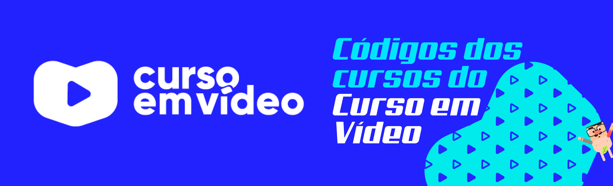

# Códigos das aulas do Curso em Vídeo

- Algoritmo - Algoritmos e Lógica de programação

- Java Básico

- Java POO - Curso de Programação Orientada a Objetos

- Javascript - Curso voltado para iniciantes sobre ECMAScript
